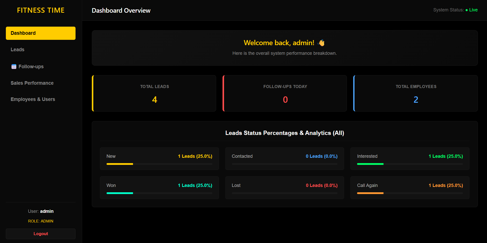

\# Fitness Time CRM


A full-stack Customer Relationship Management (CRM) system designed to help manage leads, customer data, sales activities, follow-ups, and team performance.


\## 🚀 Features


\* 📊 Dashboard with sales and lead statistics

\* 👥 Lead and customer management

\* 📞 Contact and follow-up management

\* 🎯 Lead status tracking

\* 👨‍💼 Salesman assignment

\* 💬 Customer comments and notes

\* 🔐 JWT-based authentication

\* 🔒 Password hashing with bcrypt

\* 🗄️ SQLite database

\* 📱 Responsive web interface


\## 🛠️ Technologies


\### Frontend


\* React.js

\* JavaScript

\* HTML5

\* CSS3

\* Vite


\### Backend


\* Node.js

\* Express.js

\* SQLite

\* REST API

\* JWT

\* bcrypt


\### Tools


\* Git

\* GitHub

\* VS Code


\## 📁 Project Structure


```text

fitness-time-crm/

├── backend/

│   ├── package.json

│   ├── package-lock.json

│   └── server.js

├── frontend/

│   ├── src/

│   ├── public/

│   ├── package.json

│   ├── package-lock.json

│   └── vite.config.js

├── START CRM.bat

├── .gitignore

└── README.md

```


\## ⚙️ Installation


\### 1. Clone the repository


```bash

git clone https://github.com/Yusif-Hany/fitness-time-crm.git

cd fitness-time-crm

```


\### 2. Install backend dependencies


```bash

cd backend

npm install

```


\### 3. Configure environment variables


Create a `.env` file inside the `backend` folder:


```env

SECRET\_KEY=your\_secret\_key

```


\### 4. Start the backend


```bash

node server.js

```


\### 5. Install frontend dependencies


Open another terminal:


```bash

cd frontend

npm install

```


\### 6. Start the frontend


```bash

npm run dev

```


The frontend will be available at:


```text

http://localhost:5173

```


\## 🔒 Security


Sensitive files such as environment variables, SQLite databases, dependencies, and build files are excluded from the Git repository using `.gitignore`.


\## 📌 Project Status


This project was developed as a practical full-stack software development project to gain hands-on experience in building and managing a real-world CRM application.


\## 👨‍💻 Developer


\*\*Yusif Hany\*\*


Computer Science Student

Modern University for Technology \& Information (MTI)


GitHub: \[Yusif-Hany](https://github.com/Yusif-Hany)


## 📸 Screenshots

### Dashboard


